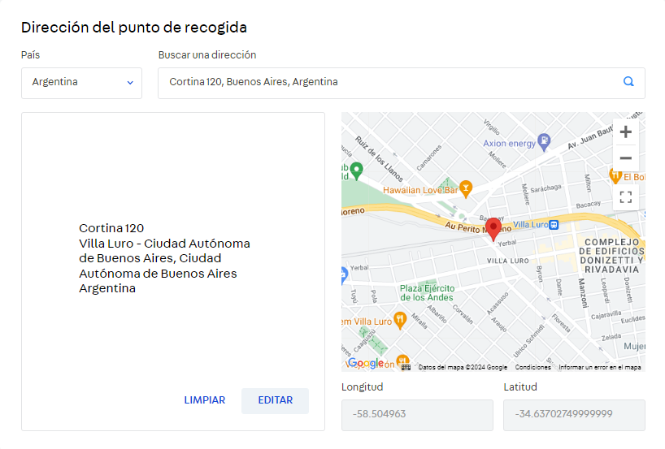
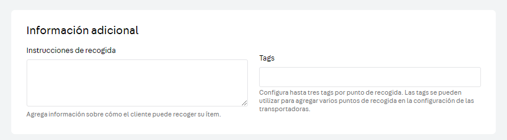
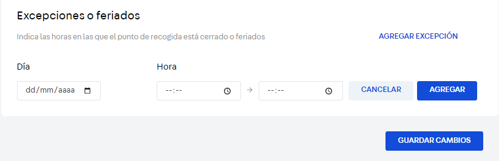
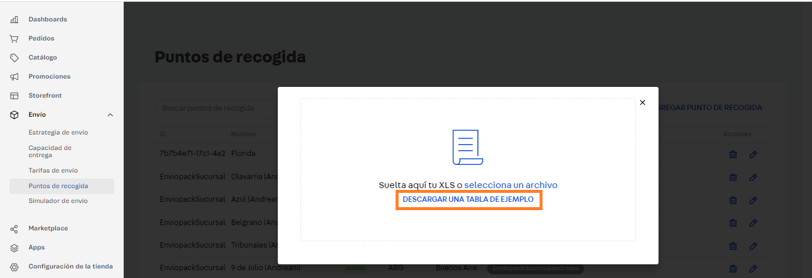
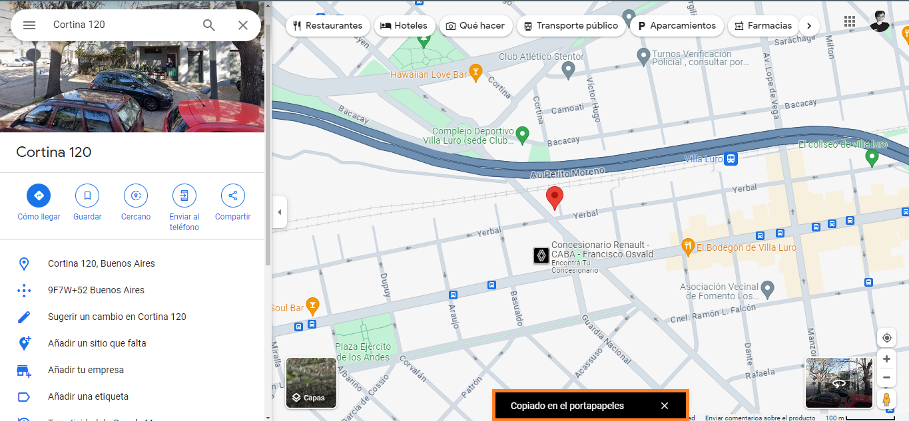

# 💻 Puntos de recogida

## Nueva sucursal

Para agregar, modificar o sacar sucursales, es necesario dirigirnos al Admin e ingresar a la sección **Envío -> Puntos de recogida.**

<figure><figcaption></figcaption></figure>

De este modo, tendremos dos formas posibles de agregar una sucursal, de forma manual o masiva.

### **Sumar sucursal manualmente**

Para agregar una sucursal manualmente, debemos hacer click en **"**+ AGREGAR PUNTO DE RECOGIDA".

<figure><figcaption></figcaption></figure>

Ese botón nos llevará directamente a la siguiente ventana, en la que haremos toda la configuración del punto de recogida:

<figure><figcaption></figcaption></figure>

**Nombre:**  Colocaremos el nombre que queremos que sea visible para los clientes a la hora de ver sucursales. Por ejemplo, Palermo.

**ID:** Elegiremos un ID que queramos asignar al punto. Éste debe ser único, por lo que podría ser un número que ayude a identificar la sucursal.&#x20;


Es posible en algunas localidades que el nombre se repita, por eso es importante que el ID sea distinto y único para cada caso


Punto de recogida de terceros: Marcaremos esta flag si el punto de recogida no es una ubicación asociada a la tienda. Las ubicaciones de terceros se muestran con menos prioridad que los puntos de tiendas.

Dirección del punto de recogida: Debemos seleccionar el país y desde el campo "Buscar una dirección", podremos buscar la dirección exacta de la sucursal y el mapa completará el resto de los datos (Barrio y Localidad).&#x20;

<figure><figcaption></figcaption></figure>


En el caso que el código postal no se complete (como en el ejemplo anterior), tendremos que realizar la carga MASIVA de ese punto. Si no, el punto no se mostrará correctamente en el mapa.


Lo siguiente será el módulo de información adicional, que permite establecer instrucciones de recogida que se mostrarán en el mapa (Por ejemplo, llevar DNI) y los Tags, que servirán por varias cosas:

* Podemos configurar qué puntos mostrar en el mapa (y cómo mostrarlos, esto se hace desde desarrollo).
* Podemos asignar todos los puntos que tengan un tag específico a una estrategia de envío.

Cabe mencionar que sólo podemos asignar tres tags a cada punto de recogida, por lo que debemos ser criteriosos a la hora de asignar tags.

<figure><figcaption></figcaption></figure>

VTEX no permite poder habilitar distintos horarios de apertura. Por ejemplo, locales que cierren al mediodía para almorzar. En esos casos, lo mejor será aclarar en instrucciones que podría no estar abierto de determinada a determinada hora.

<figure><figcaption></figcaption></figure>

Finalmente, tendremos la opción de asignar una excepción o feriado en el que este punto no estará activo. Para ello se selecciona el día y la franja horaria.

<figure><figcaption></figcaption></figure>


Si tildamos un día como abierto y no ponemos horario, VTEX interpretará que estará abierto todo el día. Lo mismo sucede con las excepciones, si asignamos una excepción y no le ponemos horario, VTEX tomará como que estará cerrado todo el día.


### Sumar sucursal masivamente

Para poder agregar una sucursal de forma masiva, debemos hacer click en "CARGAR UN XLS"

<figure><figcaption></figcaption></figure>

Allí se abre un modal que nos permite subir un archivo o descargar la tabla de ejemplo. Optaremos primero por esta segunda opción.&#x20;

<figure><figcaption></figcaption></figure>

La tabla se descarga con unos ejemplos que tendremos que borrar, y podremos comenzar a llenar con nuestros datos.

<figure><figcaption></figcaption></figure>

En cuanto a los campos por cargar, serán casi todos los mismos que cargamos manualmente. Nosotros mantendremos los mismos datos que usamos en la carga manual.

* **ID:** Será el id de nuestro punto. Recordar que este código debe ser único para cada punto de recogida.
* **Name:** Será el nombre visible del punto. Por ejemplo: Villa Luro.
* **Description:** Es la descripción que saldrá en el checkout, no es obligatoria.
* **Instructions:** Instrucciones de entrega. Por ejemplo: Traer DNI. No es obligatoria.
* **Countryname**: Es el país, importante ser específicos. En este caso, Argentina.
* **City:** Pondremos la provincia/ciudad, en este caso, textualmente Ciudad Autónoma de Buenos Aires.
* **PostalCode:** Importante contar con el código postal, no era necesario en la carga manual pero lo será en la carga masiva.
* **CountryAcronym:** Código de 3 dígitos del país según la norma ISO 8601 (RFC 3339). En este caso, ARG.
* **State:** Estado o provincia, en todos los casos será igual que City, Ciudad Autónoma de Buenos Aires para el ejemplo.

Por ahora, la planilla quedaría así:

<figure><figcaption></figcaption></figure>

Es importante seguir las instrucciones de Latitude y Longitude al pie de la letra, ya que, junto con ID, son los únicos campos que NO se pueden modificar una vez ya cargados en VTEX los puntos.

* **Latitude y Longitude:** Estos campos no los tenemos en la carga manual pero que necesitaremos sí o sí en masivo. La forma más fácil de obtener estos datos, es buscar la dirección en Google Maps y  dar click derecho.

<figure><figcaption></figcaption></figure>

Al hacer click en la primer opción, ya nos copiará las coordenadas.

<figure><figcaption></figcaption></figure>

Ahora debemos dirigirnos al Excel y para evitar que Excel haga inconvenientes con los formatos, tocaremos la celda Latitude y pegaremos los valores dentro de la barra que hay en la parte superior pero SIN PRESIONAR ENTER:

<figure><figcaption></figcaption></figure>

Todavía sin presionar enter, haremos dos cosas: cambiaremos los puntos '.' por comas ',' y cortaremos (CONTROL + X) el segundo valor (que corresponde a la longitud) y eliminaremos el espacio y la coma final de la latitud.

<figure><figcaption></figcaption></figure>

<figure><figcaption></figcaption></figure>

Así nos queda Latitude:

<figure><figcaption></figcaption></figure>

Y ahora pegamos el valor que cortamos en la celda de Longitude:

<figure><figcaption></figcaption></figure>

Continuamos entonces con los campos faltantes:

* **Neighborhood**: Es el barrio, en este caso dijimos Villa Luro.
* **Street:** Acá va el nombre de la calle, que sería en este caso Cortina.
* **Number:** Y el número correspondiente a esa calle, en este caso 120.
* **Complement:** Si hay un número de local, piso, oficina, sería ideal (ej Planta alta b). Por ej: Piso 1.
* **Reference:** También podremos agregar una referencia, como decir "A 20 metros de la esquina".
* **IsActive:** Nos permite determinar si está activa, TRUE, o inactiva, FALSE. \
  Las inactivas no se mostrarán en el listado.

Por ahora nos quedaría así el Excel:

<figure><figcaption></figcaption></figure>

*   **BusinessHours:** Es un campo que, si sabemos completarlo correctamente en excel, nos ahorrará muchísimo tiempo. Cada valor de esta celda está separado por punto y coma, y esos valores se componen de tres elementos separados por comas.\
    Se completa así: <mark style="background-color:blue;">día,hora inicio,hora fin</mark>;<mark style="background-color:red;">día,hora inicio, hora fin</mark>;<mark style="background-color:orange;">día,hora inicio,hora fin.</mark>\
    El punto y coma divide cada día, y el último elemento **NO** termina en punto y coma (si no VTEX dará error).

    El elemento **día** será numérico, del 0 al 6, en el que cada número equivale a un día específico: 

    * 0: Domingo
    * 1: Lunes
    * 2: Martes
    * 3: Miércoles
    * 4: Jueves
    * 5: Viernes
    * 6: Sábado

    Y tanto el horario de inicio como el de fin, será con el formato <mark style="background-color:blue;">hh</mark>:<mark style="background-color:red;">mm</mark>:<mark style="background-color:orange;">ss</mark>, siendo:\
    <mark style="background-color:blue;">hh:</mark> **Hora**

    <mark style="background-color:red;">mm:</mark> **Minuto**

    <mark style="background-color:orange;">ss:</mark> **Segundo**

Entonces, si quisiera marcar que sólo estará abierto el lunes de 8 a 20, tendría que escribir lo siguiente:

**1,08:00:00,20:00:00**

Y nada más, como es un solo elemento NO utilizamos el punto y coma. Y los días que no incluiremos, tampoco debemos escribirlos. Ahora, sí queremos indicar que estará abierto lunes y martes de 8 a 20, ahí sí tendría que utilizar punto y coma, y quedaría de la siguiente forma:

**1,08:00:00,20:00:00;2,08:00:00,20:00:00**

Ahora bien, en nuestro ejemplo, el local de Palermo estaba abierto de lunes a domingo de 10 a 20. Bien, para ello debería quedar así, en una misma celda:

**0,10:00:00,20:00:00;1,10:00:00,20:00:00;2,10:00:00,20:00:00;3,10:00:00,20:00:00;4,10:00:00,20:00:00;5,10:00:00,20:00:00;6,10:00:00,20:00:00**

Así tendríamos nuestra ventana horaria configurada todos los días.

*   **PickupHolidays:** Si hay algún día que haremos excepción y no se trabajará en esa sucursal, también podemos indicarlo desde masivo.\
    El formato será parecido al anterior, sólo que tendremos que indicar la fecha específica y no el día.

    En el caso de un feriado el 28 de diciembre de 2023 se rellenaría de la siguiente manera:

    2023-12-28,00:00,00:00

    En el caso de un feriado el 25 de noviembre de 2023 con funcionamiento a partir de las 13 horas se rellenaría de la siguiente manera:

    2023-11-25,00:00,13:00
* **Tags:** En este último campo incluiremos las etiquetas, separado con punto y coma si es más de una. Es decir que si quisiéramos poner las etiquetas pow y retirosucursal, sería: pow;retirosucursal.

Y así nos quedaría la última parte del Excel:

<figure><figcaption></figcaption></figure>

Ahora deberíamos simplemente cargarla, y esperar que procese los nuevos puntos de recogida.

<figure><figcaption></figcaption></figure>
