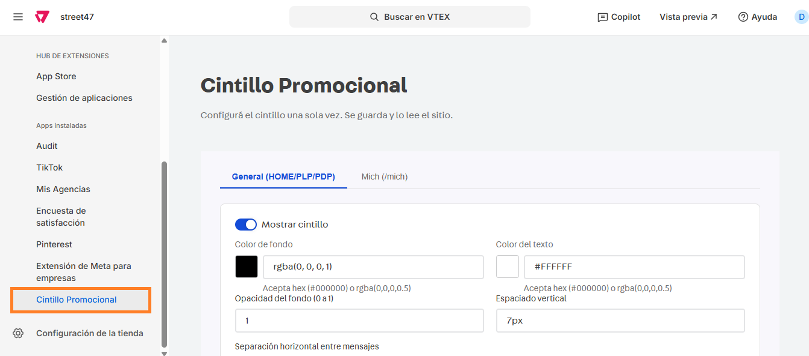

# 📌 Cintillo de promociones

## Descripción

Este aplicación permite cargar varias leyendas en un cintillo dinámico que va mostrando los mensajes en loop.&#x20;

La aplicación permite editar el color de los textos, fondo, espaciado entre textos, configurar links, cantidad de mensajes y la posibilidad de mostrar u ocultar mensajes dentro del componente.&#x20;

<figure><figcaption></figcaption></figure>


Se deberá cargar una configuración para el sitio en general como para la landing de Mich


<figure><figcaption></figcaption></figure>

#### Pasos para la configuración

1.  Ingresar al administrador de VTEX por **Apps > Apps instaladas > Cintillo promocional.**  

    <figure><figcaption></figcaption></figure>
2. Al ingresar a la aplicación, vamos a encontrar dos tabs que nos permitirán cargar los estilos de forma **GENERAL** (para home, PLP y PDP) y **MICH** (para la landing /mich, donde sólo se ajustarán estilos ya que los mensajes los tomará de la configuración general).&#x20;
3.  Si ingresamos por GENERAL, encontraremos las configuraciones: 

    <figure><figcaption></figcaption></figure>

    1. **Mostrar cintillo?:** Permite activar o desactivar el componente
    2. **Color de fondo:** Permite configurar el color de fondo del cintillo en formato hexadecimal o rgba.&#x20;
    3. **Color del texto:** Permite configurar el color del texto del cintillo en formato hexadecimal o rgba.&#x20;
    4. **Opacidad del fondo:** Permite configurar la opacidad del fondo en un número comprendido entre 0 y 1.&#x20;
    5. **Separación horizontal entre mensajes:** Permite asignar en px el espaciado entre cada texto del cintillo promocional.&#x20;
    6. **Espaciado vertical:** Permite asignar en px el espaciado arriba y abajo del texto del cintillo promocional.&#x20;
    7. **Mensajes:**  Se listarán los mensajes ya configurados en el sitio con su **Título y Descripción.** Soporta \*\*negrita\*\*, \[link]\(url) y emojis 🎉. \
       Desde el CTA **Agregar mensaje** se podrán cargar cada uno de los mensajes con sus respectivas configuraciones.
       1. **Titulo:** Podemos completar con un título para identificar cada uno de los mensajes (no se mostrará en el cintillo).
       2. **Texto del mensaje:** Se debe completar con el mensaje que se mostrará en el cintillo. En caso de querer agregar un link, se deberá completar entre corchetes "\[]" la palabra que contendrá el link y entre paréntesis "()"  el link. Por ej: PICK UP EN \[STORES]\(/stores).

<figure><figcaption></figcaption></figure>

4. Una vez que completamos toda la configuración, podemos hacer click en **Guardar** para aplicar los cambios.&#x20;
5. Para el caso de Mich, tendremos las mismas opciones que para la configuración general exceptuando los mensajes, que los tomará de la configuración **GENERAL**.&#x20;

<figure><figcaption></figcaption></figure>

