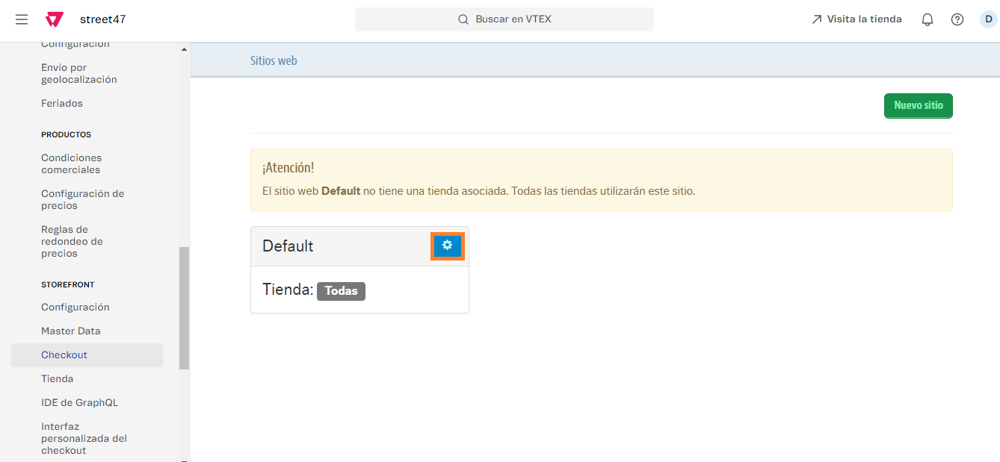
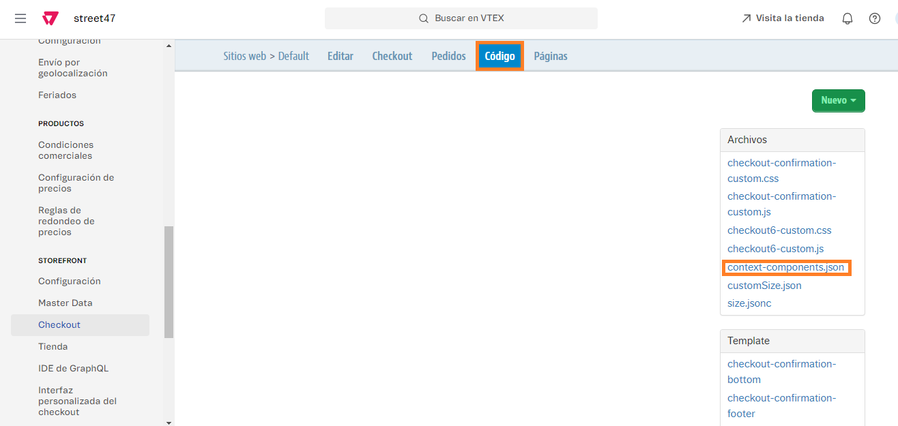
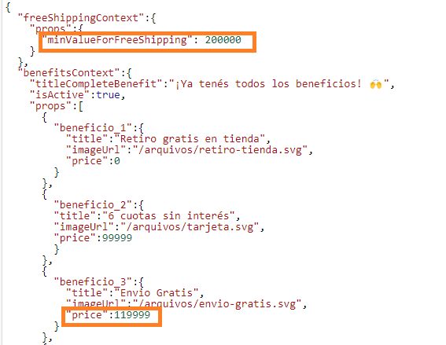

# 📌 Cálculo de envío gratis en carrito

## Descripción

Le permite al usuario visualizar cuánto dinero le falta para obtener el envío gratis.


El componente cuenta con una barra que se va completando a medida que se acerca al valor del mínimo de compra. La misma es opcional pero debe comentarla o no el desarrollador, no lo puede administrar el cliente.&#x20;

Se puede modificar el monto mínimo para el envío gratis desde el componente.


## **Pasos para la configuración**

1. Acceder al administrador de VTEX.
2. Ingresar por **Configuración de la tienda > Storefront > Checkout**\
   .png>)
3.  Al ingresar, debemos hacer click en la ruedita ubicada al lado del nombre de la tienda: Default<br>

    <figure><figcaption></figcaption></figure>
4.  Una vez allí, nos dirigimos a la pestaña **Código** y hacemos click en el archivo llamado **context-components.json**<br>

    <figure><figcaption></figcaption></figure>
5. Al ingresar al archivo nos encontraremos con este pedazo de código:&#x20;

```json
{
  "freeShippingContext":{
    "props":{
      "minValueForFreeShipping": 200000
    }
  },
```

6. De dicho código, únicamente debemos editar el valor del campo "minValueForFreeShipping". Por ejemplo, si quisiéramos que el monto mínimo sea $300.000, deberá quedar así:

```json
{
  "freeShippingContext":{
    "props":{
      "minValueForFreeShipping": 300000
    }
  },
```

7. Una vez modificado, sólo debemos hacer click en **Guardar**

<figure><figcaption></figcaption></figure>


Recordar que al tener habilitada la barra de beneficios del carrito, es necesario igualar los montos que se visualizan tanto en este componente como en el beneficio de la barra de beneficios.


<figure><figcaption></figcaption></figure>

