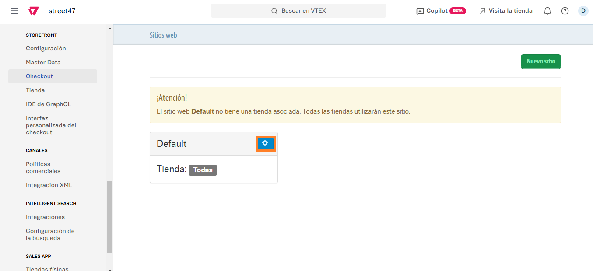
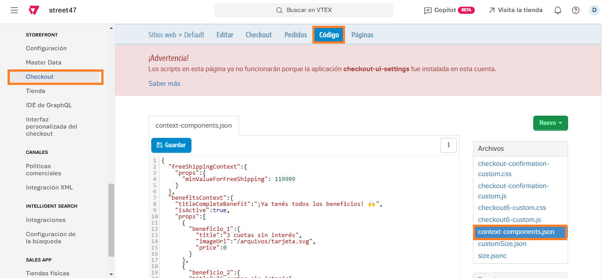

# 📌 Carrusel de productos recomendados en carrito

## **Descripción** <a href="#descripcion" id="descripcion"></a>

Este componente permite ofrecer en el carrito productos recomendados para completar la compra, pudiendo agregarlos directamente desde allí, sin necesidad de volver a la ficha.

<figure><figcaption></figcaption></figure>

## **Pasos para la configuración** <a href="#pasos-para-la-configuracion" id="pasos-para-la-configuracion"></a>

1. Acceder al administrador de VTEX.
2. Ingresar por **Configuración de la tienda > Storefront > Checkout**

<figure><figcaption></figcaption></figure>

3.  Al ingresar, debemos hacer click en la ruedita que se encuentra junto al nombre de la tienda<br>

    <figure><figcaption></figcaption></figure>
4.  Una vez allí, hacemos click en la pestaña **Código** y en el archivo llamado **context-components.json**<br>

    <figure><figcaption></figcaption></figure>
5.  Al ingresar, debemos situarnos en esta porción de código:

    ```
      "carouselSuggestedProducts": {
        "isActive": true,
        "titleText": "También te pueden interesar:",
        "collectionId": "187"
      }
    ```

    6. Allí podremos editar si el carrusel se encuentra activo o no, el título del carrusel y la colección que levanta.

    ## Campos

    * **"isActive"**: se colocará <mark style="background-color:blue;">true</mark> en caso de que esté activo y <mark style="background-color:red;">false</mark> en caso de querer apagarlo.
    * **"titleText"**: se colocará entre comillas (" ") el título del carrusel como se visualiza en el ejemplo de arriba.&#x20;
    * **"collectionId"**:  se colocará entre comillas (" "), el id de la colección que queremos mostrar
    * Luego de modificar la colección, debemos hacer click en **Guardar** para que se actualicen los cambios.

    <figure><figcaption></figcaption></figure>

    <div data-gb-custom-block data-tag="hint" data-style="info" class="hint hint-info"><p>Tener en cuenta que puede demorar unos minutos en impactar el cambio de colección en el carrito. También debemos asegurarnos que la colección asignada cuenta con productos y se encuentra activa, caso contrario el carrusel no se mostrará. </p></div>

    <br>
