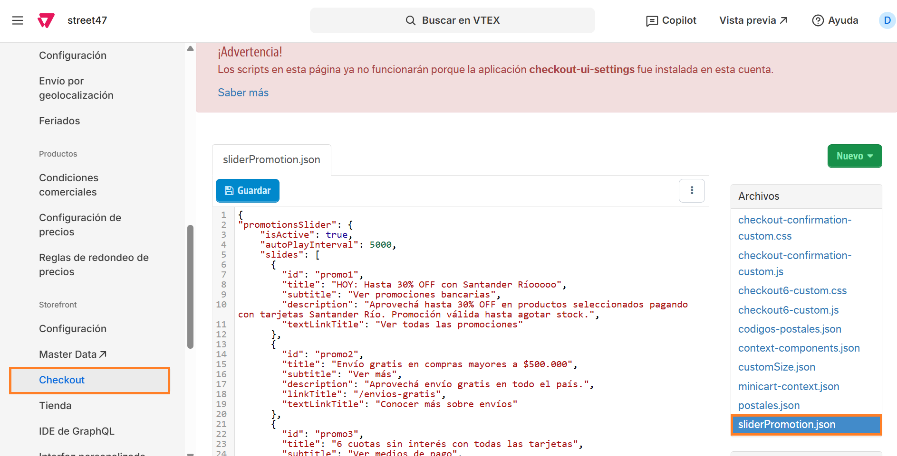

# 📌 Slider de promociones

## Descripción

Se realizó un componente custom para la visualización de un slide de promociones que se encuentra en checkout. Podrán configurar tanto promociones bancarias como las promociones que planteen tener en la web y configurar redirects.

A diferencia del componente que se encuentra en home, sábana y ficha de producto, este componente se actualiza de forma independiente mediante un archivo en el checkout.

<figure><figcaption></figcaption></figure>

## **Pasos para la configuración**

1. Acceder al administrador de VTEX.
2.  Ingresar a la **Configuración de la tienda > Storefront > Checkout > Código** y hacer click en el archivo llamado **sliderPromotion.json** 

    <figure><figcaption></figcaption></figure>
3. Al ingresar al archivo, debemos localizar las distintas secciones del archivo para realizar la carga del componente:
   1. "isActive": se deberá completar con <mark style="color:blue;">true</mark> (para activarlo) o <mark style="color:red;">false</mark> (para desactivarlo)
   2. "autoPlayInterval": 5000, es el intervalo de duración para configurar el autoplay de cada slide. Recomendamos no modificarlo. \
      .png>)
   3.  "slides": Contendrá cada una de las slides que se mostrarán en el componente. En caso de querer agregar una más, se deberá copiar un nuevo bloque (incluyendo las llaves y los elementos" 

       1. "title": Es el título de la promoción
       2. "weight": Recibe valores 100, 200, 300, 400, 500, 600, 700, 800, 900 para definir el peso de la tipografía del título.&#x20;
       3. "textLinkTitle": Es el texto que se visualizará en el CTA que abrirá el modal de promociones
       4. "target": Puede recibir los valores de "_self" (para abrir el link en la misma pestaña") o "\_blank" (para abrir el link en una nueva pestaña)_

       <figure><figcaption></figcaption></figure>
   4.  "itemsModal": Contendrá los items del modal.  

       <figure><figcaption></figcaption></figure>

       1. "\_\_editorItemTitle": Es el identificador de la promoción, no se visualizará en el modal. Por ej: "Promoción Santander Rio"
       2. "itemImage": Se completará con los datos de la imagen de la promoción.&#x20;
          1. "src": Deberá completarse es el link de la imagen de la promoción. Por ej: "/arquivos/santander.png"
          2. "alt": Deberá completarse con la descripción de la imagen de la promoción. Por ej: "Logo Santander Río"
       3. "itemTitle":
          1. "text": Deberá completarse con el título que va a tener la promoción. Por ej: "Banco Nación - 6 cuotas sin interés"
       4. "itemText"&#x20;
          1. "text": Deberá completarse con el subtitulo que va a tener la promo. Por ej: ""Acción exclusiva de BNA pagando con MODO."
       5. "itemOptionalText"
          1. "text": Texto adicional a mostrar (opcional). Se visualizará debajo del itemText
       6.  "itemDropdow"  

           <figure><figcaption></figcaption></figure>

           1. "activeDropdow": Si se completa con el valor <mark style="color:blue;">true</mark>, habilita un boton para mostrar mas información.
           2. "itemText"
              1. "text": Se deberá completar con la leyenda que se visualizará para abrir el desplegable. Por ej: "Ver más información"
           3. "contentText"
              1. "text": Se deberá completar con la leyenda que se visualizará dentro del desplegable. Por ej: "Aplica para tarjetas de Visa y Mastercard Crédito de BNA. Hasta 6 cuotas sin interés sin monto mínimo de compra."
