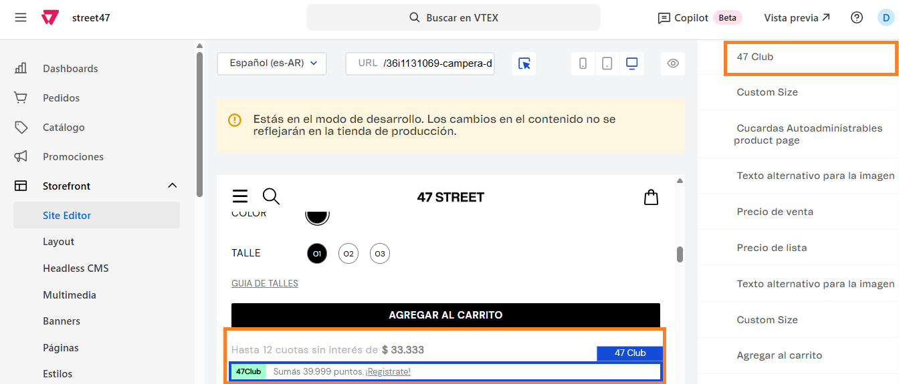

# 📌 47 Club - Calculador de puntos

## Descripción

Este componente permite mostrar en ficha la cantidad de puntos que se acumulan con la compra del producto que se está visualizando. El cálculo se realiza en base al precio final y el porcentaje configurado desde el site editor. &#x20;

### Pasos para la configuración

1. Acceder al administrador de VTEX.
2. Ingresar por **Storefront** → **Site Editor**.
3.  Al ingresar, navegar hasta la ficha de un producto o completarla manualmente desde el campo de URL: 

    <figure><figcaption></figcaption></figure>
4.  En la lista de bloques, debemos buscar el bloque llamado 47Club o bien, seleccionarlo con el puntero 

    <figure><figcaption></figcaption></figure>
5.  Dentro del componente vamos a tener la opción para que el componente se muestre o no y el campo Porcentaje de puntos, para completar el coeficiente por el cuál realizará el cálculo. 

    <figure><figcaption></figcaption></figure>
6. Una vez modificado, debemos guardar para que apliquen los cambios.&#x20;
