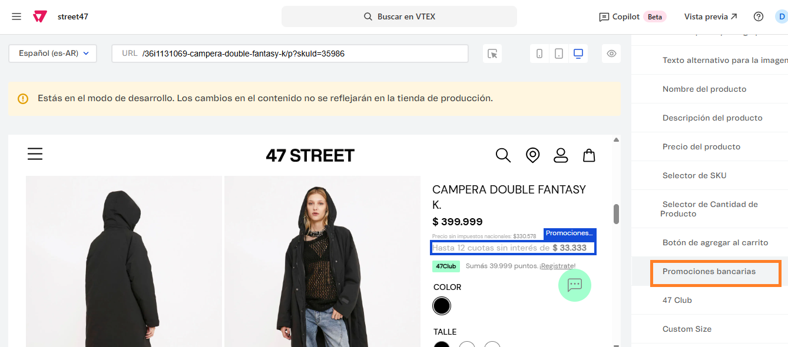
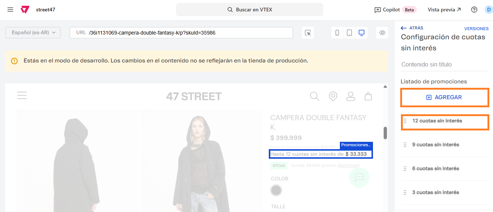

# 📌 Calculador de cuotas en ficha

## Descripción

Este componente permite mostrar la cantidad máxima de cuotas disponible para ese producto, en base a su precio. Las cuotas configuradas son:

* 12 cuotas sin interés
* 9 cuotas sin interés
* 6 cuotas sin interés
* 3 cuotas sin interés

### Pasos para la configuración&#x20;

1. Ingresar al **administrador de VTEX > Storefront > Site editor.**
2.  Al acceder, ir a la ficha de alguna producto activo para poder visualizar el componente llamado **Promociones bancarias.** 

    <figure><figcaption></figcaption></figure>
3.  Al ingresar al componente, podemos agregar la cantidad de cuotas que necesitemos y/o editar las que ya se encuentran configuradas. 

    <figure><figcaption></figcaption></figure>
4. Si ingresamos a alguna de las cuotas configuradas, podemos modificar los campos:
   1. **Nombre identificador de la cuota:** Leyenda que se visualizará en ficha
   2. **Cantidad de cuotas:** Cantidad de cuotas
   3.  **Cuotas para precio mayor a:** Nos permitirá editar el monto a partir del cula comienza a aplicar la cuota.  

       <figure><figcaption></figcaption></figure>
5. Si hacemos click en **Aplicar**, quedarán guardados los cambios de la promoción
