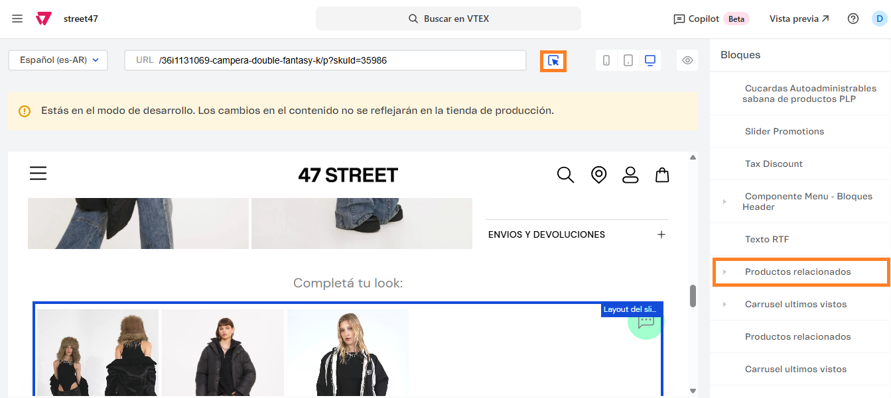
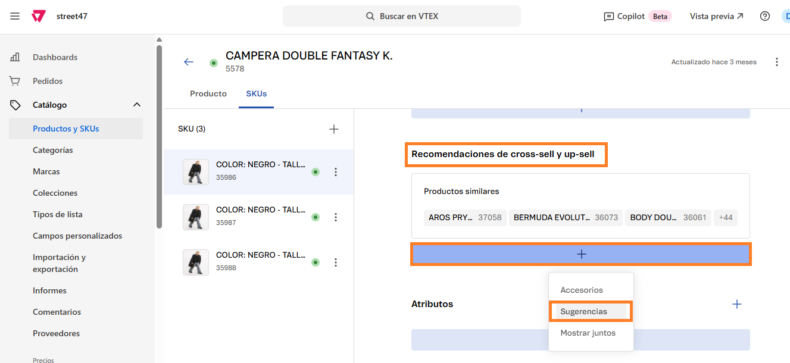

# 📌 Carrusel "Completá tu look"

## Descripción

Este carrusel permite mostrar productos sugeridos al cliente en base a distintos criterios: Comprados juntos, Vistos, Productos similares, Quién vio también compró, Accesorios y Sugerencias.&#x20;

Para este caso, se sugiere utilizar la opción de **Sugerencias** y cargar en el back del producto, las sugerencias de otros productos.&#x20;

### Pasos para la configuración

1. Acceder al administrador de VTEX.
2. Ingresar por **Storefront** → **Site Editor**.
3.  Al ingresar, navegar hasta la ficha de un producto o completarla manualmente desde el campo de URL: 

    <figure><figcaption></figcaption></figure>
4.  Podemos utilizar el puntero para seleccionar el carrusel o ingresar al bloque llamado **Productos relacionados** 

    <figure><figcaption></figcaption></figure>
5.  Al ingresar al carrusel, podemos modificar la configuración del tipo de recomendación. Para este ejemplo usaremos la opción de **Sugerencias.** Adicionalmente podremos modificar el título del carrusel y el máximo de productos a mostrar.  

    <figure><figcaption></figcaption></figure>

    <figure><figcaption></figcaption></figure>
6.  Luego debemos verificar que el producto que estamos visualizando tenga sugerencias cargadas, por lo que nos dirigiremos al catálogo y buscaremos el producto. 

    <figure><figcaption></figcaption></figure>
7.  Al ingresar, vamos a la pestaña de SKUs y en **Recomendaciones de cross-sell y up-sell,** haremos click en el "**+"** y seleccionaremos la opción **Sugerencias**.  

    <figure><figcaption></figcaption></figure>

    <figure><figcaption></figcaption></figure>
8. Una vez cargadas las sugerencias para ese producto, aplicamos los cambios y ya se verían reflejados en el carrusel.&#x20;


Si bien este ejemplo utiliza el campo sugerencias, podría utilizarse el campo similares o accesorios para el mismo propósito. Sólo debe modificarse el desplegable en el site editor y configurar los productos en el campo correspondiente.&#x20;

