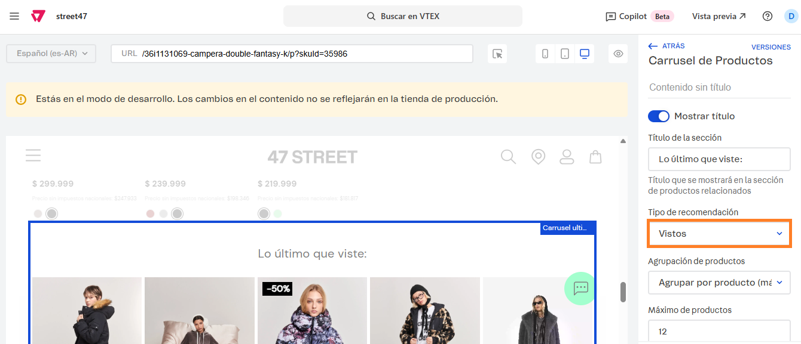

# 📌 Carrusel "Lo último que viste"

## Descripción

Este carrusel permite mostrar productos sugeridos al cliente en base a distintos criterios: Comprados juntos, Vistos, Productos similares, Quién vio también compró, Accesorios y Sugerencias.&#x20;

Para este caso, se sugiere utilizar la opción de **Vistos** y no es necesario realizar ninguna configuración adicional, ya que VTEX mostrará lo último visto por el usuario.&#x20;

### Pasos para la configuración

1. Acceder al administrador de VTEX.
2. Ingresar por **Storefront** → **Site Editor**.
3.  Al ingresar, navegar hasta la ficha de un producto o completarla manualmente desde el campo de URL: 

    <figure><figcaption></figcaption></figure>
4.  Podemos utilizar el puntero para seleccionar el carrusel o ingresar al bloque llamado **Carrusel últimos vistos** 

    <figure><figcaption></figcaption></figure>

5.  Al ingresar al carrusel, debemos verificar que el desplegable se encuentre seleccionando "**Vistos**". Adicionalmente podremos modificar el título del carrusel y el máximo de productos a mostrar.  

    <figure><figcaption></figcaption></figure>
6. Una vez configurado, debemos **Guardar** para que apliquen los cambios.&#x20;
