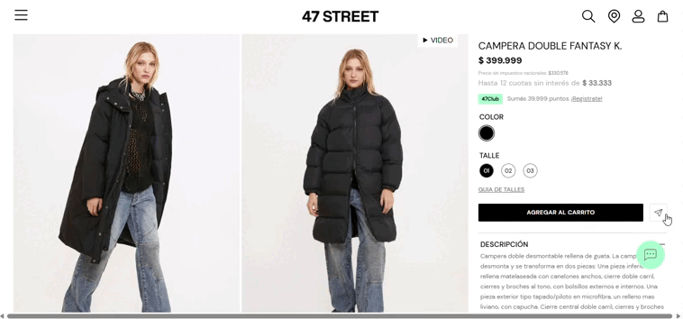
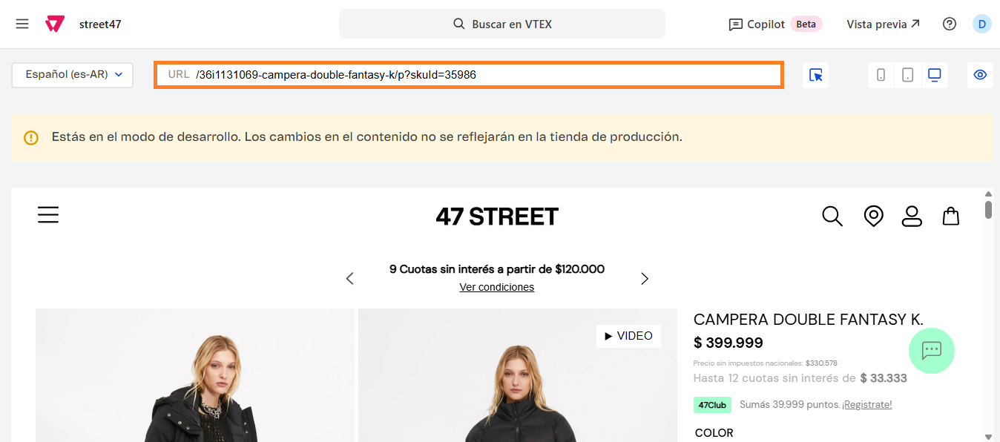
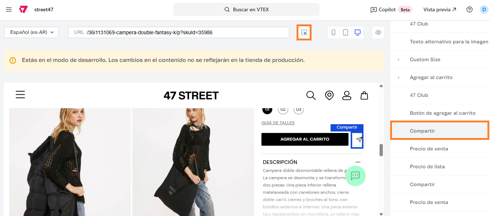

# 📌 Compartir por Whatsapp

## Descripción

Este componente le permite a los usuarios compartir un producto por Whatsapp con un click.&#x20;

<figure><figcaption></figcaption></figure>

### Pasos para la configuración

1. Acceder al administrador de VTEX.
2. Ingresar por **Storefront** → **Site Editor**.
3.  Al ingresar, navegar hasta la ficha de un producto o completarla manualmente desde el campo de URL: 

    <figure><figcaption></figcaption></figure>
4.  En la lista de bloques, debemos buscar el bloque llamado Compartir o bien, seleccionarlo con el puntero. 

    <figure><figcaption></figcaption></figure>
5.  Al ingresar al componente, podremos habilitar o deshabilitar la opción de compartir. 

    <figure><figcaption></figcaption></figure>
6. Una vez configurado, debemos hacer click en **Guardar** para que se efectúen los cambios.&#x20;


El componente permite activar  otras opciones como compartir por Twitter, Facebook, etc. \
Sin embargo el maquetado está pensado para tener una única opción activa.&#x20;

