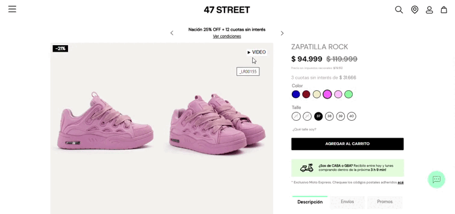

# 📌 Visor 3D en ficha - Cappasity

## Descripción

Este componente permite mostrar un modelo 3D del producto seleccionado en ficha de producto.

<figure><figcaption></figcaption></figure>

Debido a que no existía una integración nativa entre Cappasity y VTEX, se realizó la integración mediante un pequeño backend que permite conectar ambas plataformas.&#x20;

Sin embargo, para que el componente se visualice correctamente en todas las variantes del mismo producto, es necesario seguir una serie de pasos al momento de crear la imagen en Cappasity.&#x20;

### Consideraciones

1. Al ingresar en Cappasity para crear un nuevo producto, el mismo debe respetar una determinada estructura en su SKU para que en  todas las variantes (talles) del mismo producto se visualice el video en ficha. **En caso de no respetar esta estructura, es probable que el video no se renderice correctamente en todos los talles.**&#x20;
2.  El SKU debe componerse de la siguiente forma:

    <mark style="color:red;background-color:red;">NOMBRE DEL PRODUCTO + COLOR + NOMBRE DEL COLOR</mark>  \
    (de la misma forma que está escrito en VTEX). \
    Por ej: Para el caso de las zapatillas rock, el nombre del SKU debe ser: \
    <mark style="color:red;background-color:red;">ZAPATILLA ROCK COLOR ROSA OSCURO</mark> 

    <figure><figcaption></figcaption></figure>

    De esta forma, podemos incluir el modelo en todos los talles de la zapatilla Rock únicamente para el color rosa oscuro.&#x20;
3. Todo el nombre debe ir en mayúsculas (sin excepción).&#x20;


Tener en cuenta que cada 30 minutos, se hará una petición automática a la API de Cappasity para verificar si hay algún nuevo SKU que informar/actualizar. Por este motivo, puede que suceda que al crear un nuevo SKU en Cappasity no se vea inmediatamente reflejado en la ficha. En caso que pase más de ese tiempo, se deberá consultar con el equipo de POW para ver que sucedió.&#x20;


