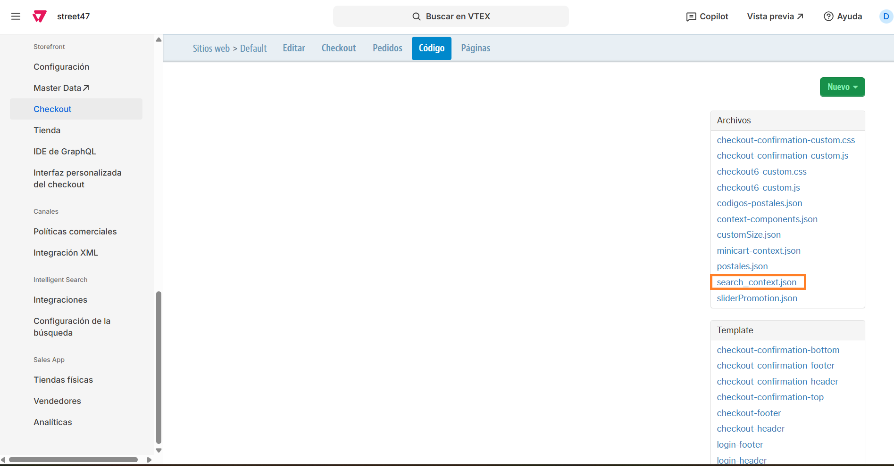
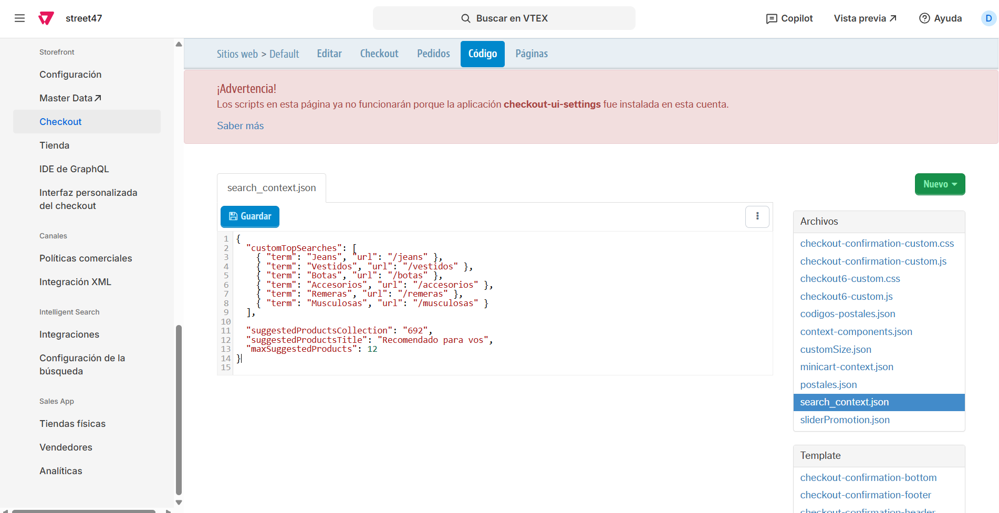

# 📌 Buscador custom

## Descripción

Este componente permite mejorar la visualización de las búsquedas y productos recomendados en el buscador. Tanto los tabs de "Lo más buscado" como el carrusel de productos que se muestra , son configurables desde un archivo del checkout.&#x20;

<figure><figcaption></figcaption></figure>

### Pasos para la configuración

1. Acceder al administrador de VTEX.
2.  Ingresar por Configuración de la tienda > Storefront > Checkout 

    <figure><figcaption></figcaption></figure>
3.  Al ingresar, debemos hacer click en la ruedita que se encuentra junto al nombre de la tienda 

    <figure><figcaption></figcaption></figure>
4.  Una vez allí, hacemos click en la pestaña **Código** y en el archivo llamado **search\_context.json** 

    <figure><figcaption></figcaption></figure>
5.  Al abrir el archivo, nos encontramos con los campos a editar: 

    <figure><figcaption></figcaption></figure>

    * **customTopSearches:** Dentro de este campo se deben configurar los tabs que se mostrarán por debajo del título "Lo más buscado". Para modificarlo, deben editar los valores que se encuentran entre comillas en los campos "term" y "url". Por ej:\
      `{ "term": "Calzado", "url": "/calzado" },`
    * **suggestedProductsCollection:** Dentro de este campo se debe configurar el ID de la colección que se mostrará como recomendación de productos. Para modificarla, deben editar el valor que se encuentran entre comillas. Por ej:\
      `"suggestedProductsCollection": "111",`
    * **suggestedProductsTitle:** Dentro de este campo se debe configurar el título que se mostrará por encima de de los productos recomendados. Para modificarlo, deben editar el valor que se encuentran entre comillas. Por ej:\
      `"suggestedProductsTitle": "Recomendado para vos",`
    * **maxSuggestedProducts**: Dentro de este campo se debe configurar el máximo de productos de la colección que se mostrará en el bloque de los productos recomendados. Para modificarlo, deben editar el valor que se encuentra en el archivo (no sumar comillas). Por ej:\
      `"maxSuggestedProducts": 12`
