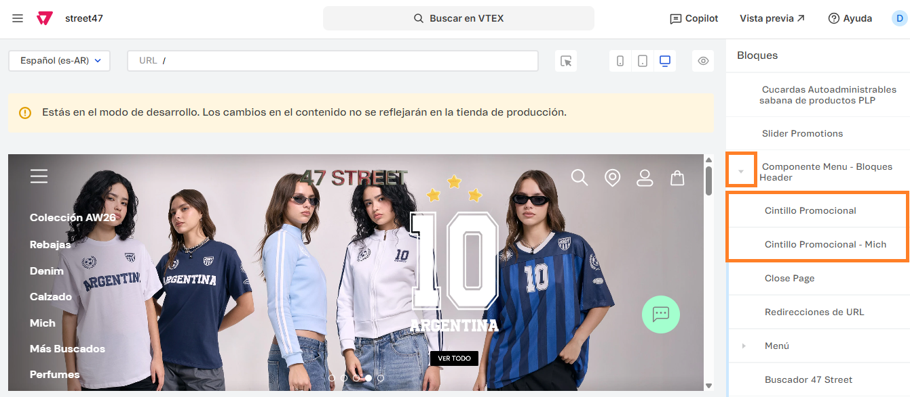

# 📌 Cintillo de promociones

## Descripción

Este componente permite cargar varias leyendas en un cintillo dinámico que va mostrando los mensajes en loop.&#x20;

Este componente permite editar el color de los textos, fondo, espaciado entre textos, configurar links, cantidad de mensajes y la posibilidad de mostrar u ocultar mensajes dentro del componente.&#x20;

<figure><figcaption></figcaption></figure>


Se deberá cargar una configuración para el sitio en general como para la landing de Mich


<figure><figcaption></figcaption></figure>

#### Pasos para la configuración

1. Acceder al administrador de VTEX.
2. Ingresar por **Storefront → Site Editor**.
3. Abrir el bloque **Componente Menú** e ingresar por el bloque **Cintillo promocional** o **Cintillo Promocional Mich** según cual debamos editar (este último sólo aplica para la configuración de /mich).

<figure><figcaption></figcaption></figure>

4. Al ingresar al bloque, encontraremos las siguientes configuraciones para realizar:
   1. **Mostrar cintillo?:** Permite activar o desactivar el componente
   2. **Color de fondo:** Permite configurar el color de fondo del cintillo en formato hexadecimal o rgba.&#x20;
   3. **Color del texto:** Permite configurar el color del texto del cintillo en formato hexadecimal o rgba.&#x20;
   4.  **Opacidad del fondo:** Permite configurar la opacidad del fondo en un número comprendido entre 0 y 1.  

       <figure><figcaption></figcaption></figure>
   5. **Espaciado vertical:** Permite asignar en px el espaciado arriba y abajo del texto del cintillo promocional.&#x20;
   6. **Espaciado horizontal:** Permite asignar en px el espaciado entre cada texto del cintillo promocional.&#x20;
   7. **Pausar al pasar el mouse:** Si esta opción se encuentra activa, al pasar el mouse sobre el cintillo, la animación se detendrá (aplica desktop).&#x20;
   8.  **Mensajes:**  Desde el CTA **+Agregar** se podrán cargar cada uno de los mensajes con sus respectivas configuraciones.  

       <figure><figcaption></figcaption></figure>
   9. **Titulo:** Podemos completar con un título para identificar cada uno de los mensajes desde el componente del site editor (no se mostrará en el cintillo).
   10. **Texto del mensaje:** Se debe completar con el mensaje que se mostrará en el cintillo. En caso de querer agregar un link, se deberá completar entre corchetes "\[]" la palabra que contendrá el link y entre paréntesis "()"  el link. Por ej: PICK UP EN \[STORES]\(/stores). 

       <figure><figcaption></figcaption></figure>
5. Una vez aplicados los cambios, hacemos click en **Aplicar** y al volver al componente hacemos click en **Guardar** para que apliquen al sitio.&#x20;
