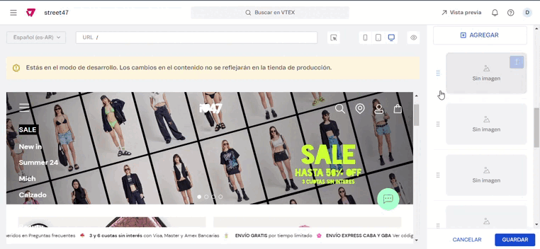

# 📌 Menú 100% autoadministrable

## Descripción

Este componente permite que el cliente pueda agregar, editar y eliminar categorías y las subcategorías del menú.


Las configuraciones que no se vean en el administrador de VTEX pueden darse por dos motivos:

1. Que falten los estilos por CSS para que eso se pueda ver (en este caso tienen que pedir que lo maqueten)
2. Que no aplique al menú esa opción.


## **Pasos para la configuración**

1. Acceder al administrador de VTEX.
2. Ingresar por **Storefront** → **Site Editor**.
3.  Una vez allí, debemos hacer click en **Componente Menú - Bloques Header.** 

    <figure><figcaption></figcaption></figure>
4.  Al ingresar, hay dos opciones que se encuentran habilitadas para que al editar, tanto el menú como el sub-menú permanezcan abiertos y no actúe como en producción: 

    <figure><figcaption></figcaption></figure>
5. Debajo podemos empezar a editar entre las distintas opciones:

* &#x20;**Color del título de la categoría:** Nos permite modificar el color de todos los títulos del menú. Aplica para todos un mismo color. Se puede elegir entre RGB y código hexadecimal.&#x20;

<figure><figcaption></figcaption></figure>

* **Fondo de la categoría:** Nos permite modificar el color del fondo de todos los títulos del menú. Aplica para todos un mismo color.&#x20;
* **Fondo de la sub/categoría:** Nos permite modificar el color del fondo de todos los títulos del menú. Aplica para todos un mismo color.&#x20;

<figure><figcaption>
 
</figcaption></figure>

*   **Desea cambiar el color del Hover?:** Esta opción habilita las opciones de fondo y color del texto al hacer Hover. \
    La misma **NO** está disponible para el caso de 47street por la forma en que está configurado.\
    En caso de estar activa, toma la configuración de los siguientes campos:

    * **Color del texto hover:** Nos permite modificar el color de todos los títulos del menú que se muestran al realizar hover.  Aplica para todos un mismo color.&#x20;
    * **Fondo del bloque hover:** Nos permite modificar el color del fondo de todos los títulos del menú que se muestran al realizar hover. Aplica para todos un mismo color.&#x20;

* **Tamaño de la fuente de las categorías:** Nos permite modificar el tamaño de la fuente de cada opción. Aplica para todos un mismo tamaño. Los tamaños varían del xx-small al xxx-large.

<figure><figcaption>
 
</figcaption></figure>

* **Grosor de la fuente de las categorías:** Permite modificar el grosor de los títulos del menú. Aplica para todos los textos un mismo grosor.

<figure><figcaption></figcaption></figure>

6. Luego, comenzamos con la sección para administrar las **“Categoría del Primer nivel.”** en la cual van a poder agregar editar y eliminar categorías principales. Permite además agregar una imagen identificatoria de cada opción del menú.\
   \
   **Agregar:** Permite agregar una nueva categoría en el menú\
   .png>)\
   Para **editar** o **eliminar** una categoría, se debe hacer click en los 3 puntitos ubicados a la derecha de dicha categoría y optar por una de las dos opciones. \
   Por ej para el caso de 47street: Si queremos eliminar la categoría **Gift Guide,** hacemos click en la categoría y seleccionamos la opción **"Eliminar".**

<figure><figcaption></figcaption></figure>

<figure><figcaption></figcaption></figure>

7. Para modificar la posición de una categoría, se debe hacer click en los 6 puntitos que se encuentran a la izquierda de cada una y arrastrarla a la posición deseada&#x20;

<figure><figcaption></figcaption></figure>

8. Al hacer click en alguna de las categorías podemos editar:

* Nombre categoría principal
*   Link de esta categoría 

    <figure><figcaption></figcaption></figure>
* Una sección que permite configurar que ese link abra en una pestaña externa del navegador (no aplica al menú de 47 Street).
* También un campo que permite agregar el link en caso que haya una opción de VER TODOS (aplica menú Prestigio).

<figure><figcaption></figcaption></figure>

*   Una opción que permite subir una imagen para que la misma se muestre como ícono de la categoría 

    <figure><figcaption></figcaption></figure>
* En caso de querer modificar el color de esta categoría (y que no aplique al resto) se podrá realizar desde estas opciones:
  * **Color del titulo de la categoría** (Aplica solo a este elemento)
  * &#x20;**Fondo de la categoría** (Aplica solo a este elemento)
  *   **Color del fondo al hacer hover** (Aplica solo a este elemento)

      <figure><figcaption></figcaption></figure>


Aclaración: en el caso de 47street, la configuración de la categoría **Sale** se tuvo que hacer por código debido a que el fondo cambia<mark style="background-color:purple;">.</mark>


*   Para dejar la categoría sin fondo es requerido tildar la opción:

    <figure><figcaption></figcaption></figure>
* Las subcategorías se encuentran dentro de la categoría, al final del bloque:

<figure><figcaption></figcaption></figure>

* Al ingresar por una Sub-Categoría, se podrá editar el nombre, agregar una imagen y el link. En caso de no hacer esto último, **no redirigirá a ninguna categoría**.\
  &#x20;

<figure><figcaption></figcaption></figure>

9. Al finalizar las configuraciones, es importante hacer click en **Aplicar (en categorías y subcategorías)** y **Guardar (en el Componente Menú - Bloques Header)**, de manera que los cambios queden guardados.&#x20;
