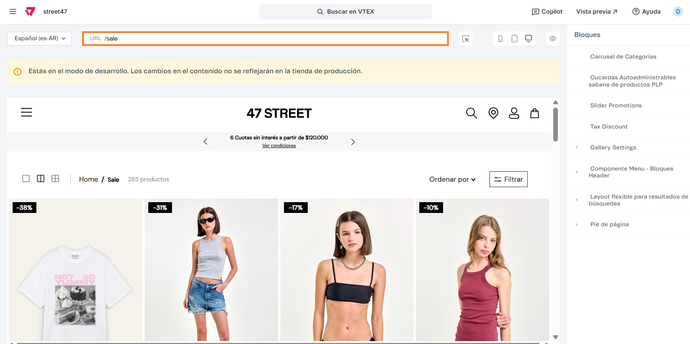
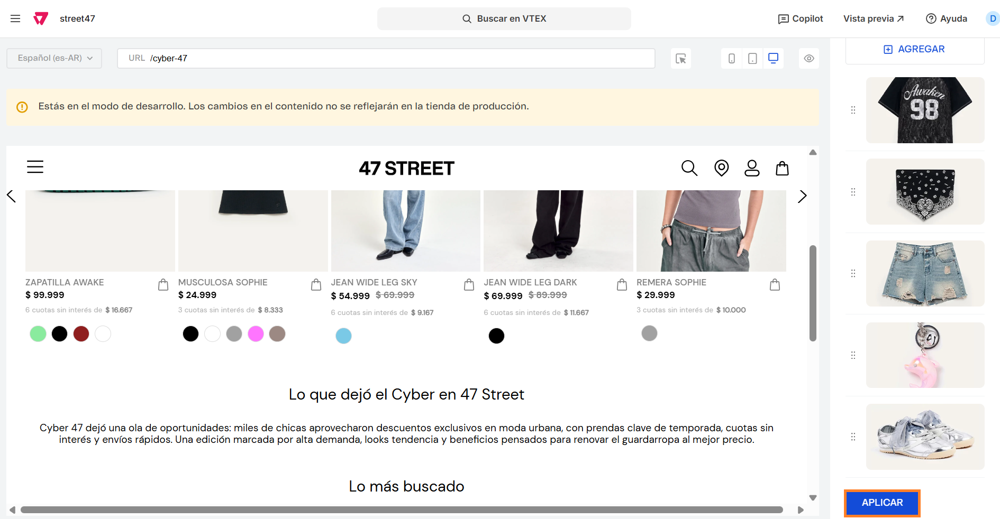

# 📌 Template en categorías inactivas

## Descripción

Este componente nos permite crear distintas landings dentro de categorías vacías para poder comunicar las categorias asociadas a hot sale, cyber, etc.\
Esto permite seguir teniendo enlazadas estas categorías en el sitio a pesar de estar fuera de temporada.&#x20;

<figure><figcaption></figcaption></figure>

### Cómo funciona

El componente "Search Result Settings" permite desactivar URLS de Search Result específicas mostrando en su lugar una landing prearmada.

La forma de desactivarla es asignando a la URL una fecha de inicio y una fecha de fin.&#x20;

En caso de que la URL no se encuentre comprendida entre esas fechas, significa que la misma no está activa y en su lugar renderiza la landing prearmada. Por ejemplo: Si hay una landing /navidad y se configura que inicia el 01/12/2025 y finaliza el 31/12/2025, a partir del 1º de Enero de 2026 va a mostrar la landing prearmada.

### Pasos para la configuración

1. Acceder al administrador de VTEX.
2. Ingresar por **Storefront** → **Site Editor**.
3.  Una vez en el sitio, se deberá ingresar en cualquier sábana de productos para ingresar al componente.  

    <figure><figcaption></figcaption></figure>
4.  Ingresar al bloque "Gallery Settings" 

    <figure><figcaption></figcaption></figure>
5.  Al ingresar al componente vamos a poder crear y/o visualizar todas las landings que ya existan y puedan habilitarse/deshabilitarse en base a un período de fechas configurado. Ejemplo: 

    <figure><figcaption></figcaption></figure>
6. Si ingresamos por /cyber-47 vamos a visualizar todos los campos que podemos editar:
   1. URL de Landing: Deben completar la url relativa de la categoría.&#x20;
   2. Título: Es el título que se mostrará cuando la sábana haya finalizado de mostrarse
   3. Fecha de inicio: Fecha a partir de la cual se mostrará una sábana
   4. Fecha de Fin: Fecha a partir de la cual se ocultará la sábana
   5. Subtítulo: Es el subtítulo que se mostrará cuando la sábana haya finalizado de mostrarse
   6.  Colección asociada: Deben colocar el ID de una colección de productos para mostrar un carrusel 

       <figure><figcaption></figcaption></figure>
   7. Título SEO: Deben colocar el título SEO para la landing
   8.  Descripción SEO: Deben colocar la descripción SEO para la landing 

       <figure><figcaption></figcaption></figure>
   9.  Lista de imágenes: Desde el botón **+Agregar** podrán agregar las imágenes, URL y títulos a mostrar en el carrusel de categorías 

       <figure><figcaption></figcaption></figure>

       <figure><figcaption></figcaption></figure>

7.  Al finalizar de cargar toda la informacion, hacemos click en **Aplicar** para guardar los cambios.  

    <figure><figcaption></figcaption></figure>
