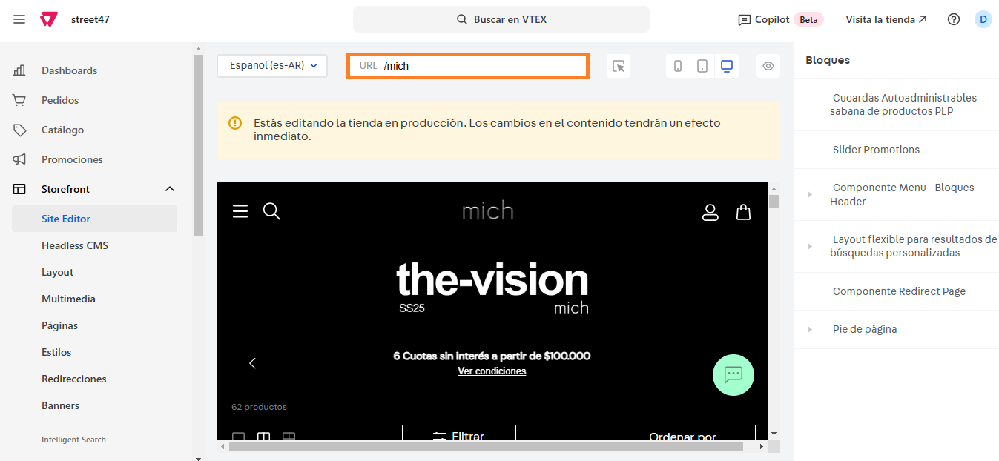
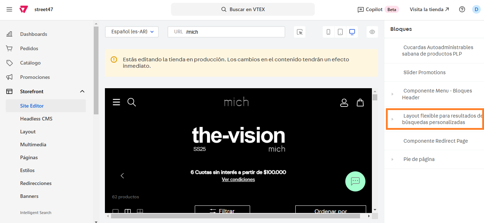

# 📌 Mostrar/ocultar talles en compra rápida en productos sin stock

## Descripción

Este componente permite mostrar/ocultar talles en compra rápida en productos sin stock.&#x20;

### Pasos para configurarlo

1. Ingresar al administrador de **VTEX > Storefront > Site Editor**.&#x20;
2.  Completar la URL donde queremos hacer la modificación. 

    <figure><figcaption></figcaption></figure>
3.  Una vez hayamos ingresado a la sábana, ingresamos al bloque llamado **Layout flexible para resultados de búsquedas personalizadas.** 

    <figure><figcaption></figcaption></figure>
4.  **C**uando ingresemos al bloque, debemos scrollear hasta visualizar el item **Ocultar ítems no disponibles**. Si lo dejamos apagado, se mostrarán los talles con y sin stock en la compra rápida.  

    <figure><figcaption></figcaption></figure>

    <figure><figcaption></figcaption></figure>
5. Por el contrario, si lo dejamos encendido se visualizarán únicamente aquellos talles que cuenten con stock.

<figure><figcaption></figcaption></figure>

