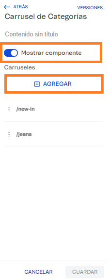

# 📌 Navegador de categorías

## Descripción

Este componente permite crear un navegador en una categoría particular, mostrando subcategorías o colecciones y redirigiendo a las mismas mediante la URL.&#x20;

Este navegador se puede crear con imagen y título o sólo título  + la URL a la que redirigirá.&#x20;

Aparece en páginas específicas en base a un patrón de URL definido en Site Editor.

<figure><figcaption></figcaption></figure>

### **¿Qué hace el componente?** 

Muestra un carrusel horizontal con slides que incluyen:

* Una imagen
* Un texto descriptivo
* Un link a una página específica
* Flechas de navegación (cuando hay más slides de las que se pueden ver)
* Indicador visual subrayado con de la categoría activa (cuando estás en esa página)

### **Pasos para la configuración** 

1. Acceder al administrador de VTEX.
2. Ingresar por **Storefront** → **Site Editor**.
3.  Una vez en el sitio, se deberá ingresar en cualquier sábana de productos para ingresar al componente. Para este ejemplo, usaremos **/newin** 

    <figure><figcaption></figcaption></figure>
4.  Una vez que ingresamos en la sábana, vamos hacer abrir el bloque **Carrusel de Categorías.**

    <figure><figcaption></figcaption></figure>
5.  Al ingresar al bloque, nos encontraremos con la opción **Mostrar componente** que nos va a permitir mostrar o no mostrar el mismo. Luego desde la sección carruseles, podemos crear los distintos navegadores de cada categoría desde el botón **+ Agregar.** 

    <figure><figcaption></figcaption></figure>
6. Al hacer click en +Agregar, podremos administrar cada uno de los carruseles de forma independiente completando las distintas opciones:
   1. **Mostrar carrusel:** Permite activar o desactivar el carrusel.
   2. **URL donde se mostrará el carrusel:** Debemos completar la URL donde se mostrará el carrusel.&#x20;
   3. **Tipo de match de URL:** Este campo es importantísimo:
      1. &#x20;Si tenés un carrusel que debe verse en múltiples subcategorías, elegí **Coincidencia Parcial:** El carrusel se muestra en cualquier URL que arranque con el texto configurado. Ejemplo: Si configuras `/jeans`, se mostrará en cualquier subcategoría de /jeans, ejemplo `/jeans/tiro-1`, `/jeans/tiro-2`, `/jeans/tiro-3`, etc.
      2. Si tenés un carrusel que va a verse en sólo un link, elegí **Coincidencia Exacta:** El carrusel solo se muestra si la URL es exactamente igual a la configurada. **Ej:** Si configuras /new-in, solo se mostrará en esa página exacta.
   4.  **Exclusiones de URL:** Permite excluir patrones de URL específicos cuando tenemos un carrusel de coincidencia parcial y queremos que se oculte en algunas subcategorías. Lo van a encontrar dentro de cada carrusel. Por ej: denim. 

       <figure><figcaption></figcaption></figure>
   5. **Configuraciones específicas del carrusel:** En esta sección encontraremos opciones para configurar en desktop y mobile. Las opciones marcadas como "opcional" no son necesarias para que el carrusel se muestra, sin embargo es importante configurar los tamaños correspondientes para que no tomen los valores configurados por default.
      1. **Ancho máximo del carrusel (px) (opcional):** Define el ancho máximo que ocupará el carrusel completo en desktop o mobile según corresponda (núm).
      2. **Máximo de slides por vista:** Cantidad de slides visibles simultáneamente en pantallas desktop (núm).
      3. **Altura máxima de la slide (px) (opcional):** Define la altura máxima de cada imagen en las slides (núm).
      4. **Ancho máximo de la slide (px) (opcional):** Define el ancho máximo de cada imagen en las slides (núm).&#x20;
      5. Espacio entre slides (px) (opcional): Separación horizontal entre cada slide del carrusel (núm).
      6.  Tamaño de la fuente de la slide (px) (opcional): Tamaño del texto descriptivo debajo de cada imagen (núm).&#x20;

          <figure><figcaption></figcaption></figure>

          <figure><figcaption></figcaption></figure>
   6.  **Slides:** Desde el botón +Agregar podemos agregar los items que se visualizarán en este carrusel 

       <figure><figcaption></figcaption></figure>
7. Al hacer click en +Agregar, nos mostrará las opciones para configurar el ítem:
   1. **Imagen:** En caso de que aplique, podemos cargar una imagen para que se visualice en el item. **Recomendación:** Usa imágenes del mismo tamaño para mantener uniformidad visual.
   2. **Texto a mostrar:** Debemos completar el título de la subcategoría a mostrar
   3. **URL de redirección al clickear:** Completaremos con la URL a la que redirigirá el sitio al hacer click.
   4.  **Target de redirección:** Podemos elegir entre "self" en el caso que queramos que cargue en la misma pestaña o "blank" en el caso que queramos abrir una nueva pestaña.  

       <figure><figcaption></figcaption></figure>
8. Una vez cargado el item, hacemos click en **Aplicar** y volveremos a la carga de slides donde podemos continuar con la carga de items. \
   Una vez completas todas, podemos hacer click en **Aplicar** para que se apliquen todos los cambios.&#x20;

### Características adicionales

#### Indicador Visual de Categoría Activa automático

Cuando un usuario está navegando en una página que coincide con el enlace de una slide, esa slide se mostrará visualmente destacada (activa), ayudando al usuario a saber en qué sección se encuentra.

#### Flechas de Navegación

Las flechas de navegación aparecerán automáticamente solo cuando haya más slides de las que se pueden ver simultáneamente en pantalla.

#### Scroll Suave

El carrusel utiliza animaciones suaves al navegar entre slides para una mejor experiencia de usuario.

 
