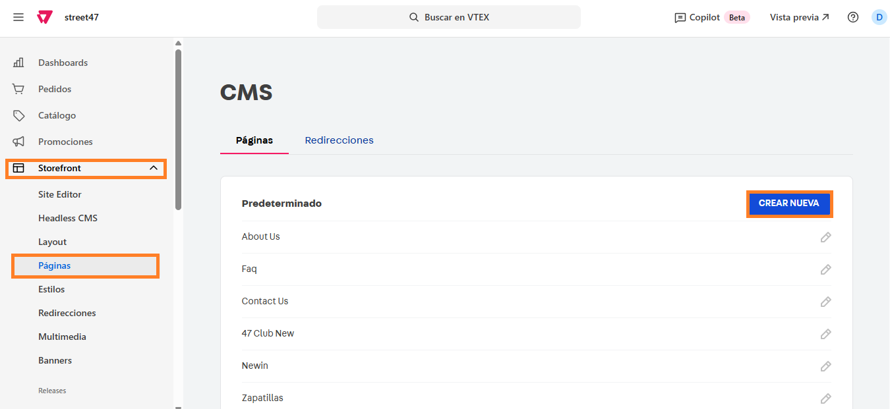
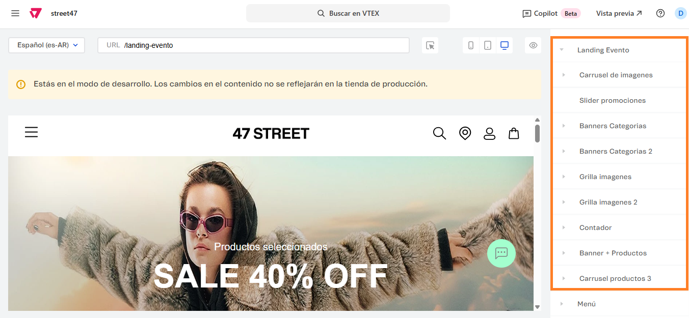
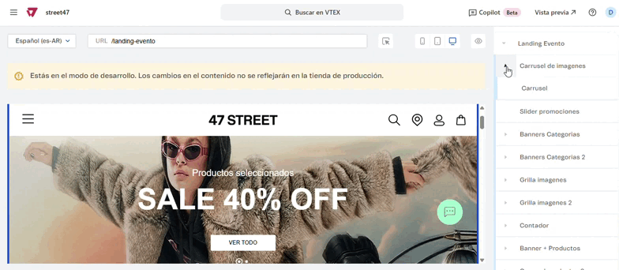
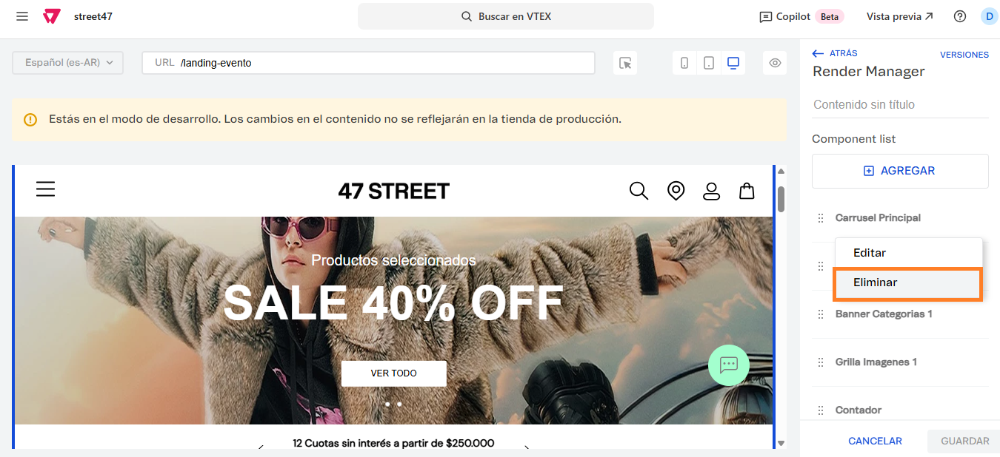
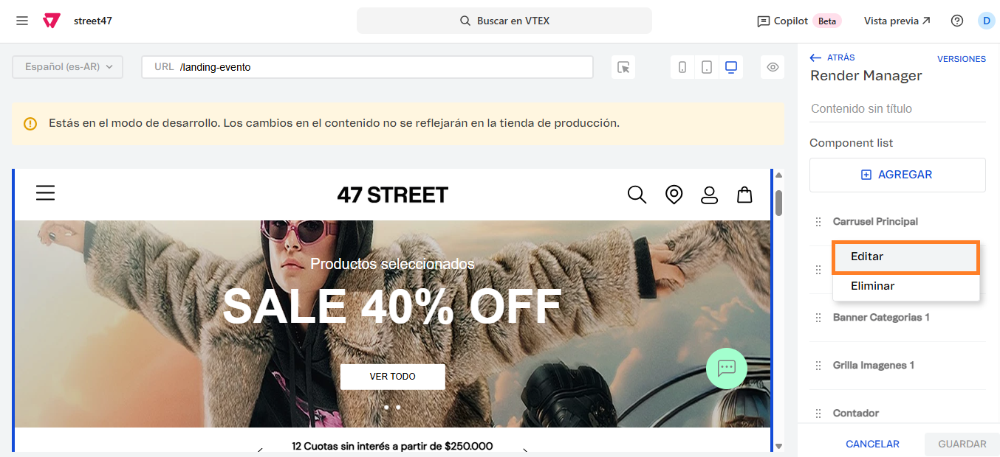
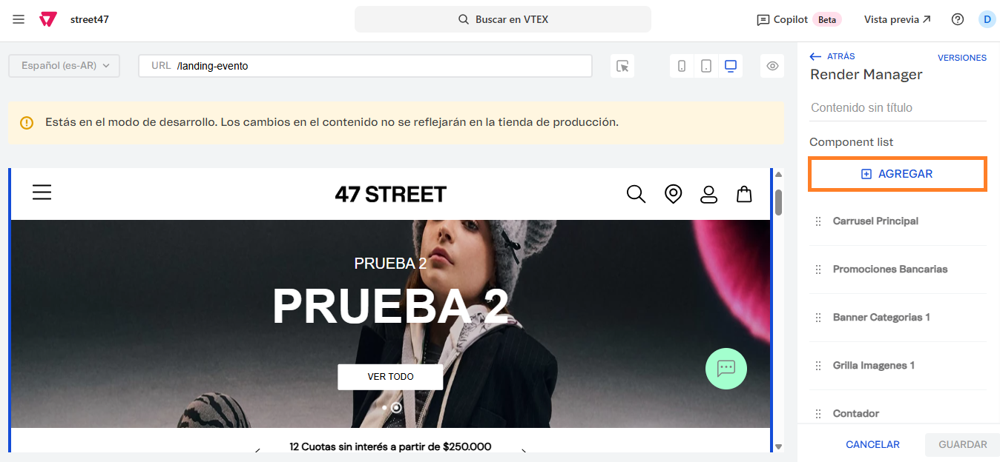
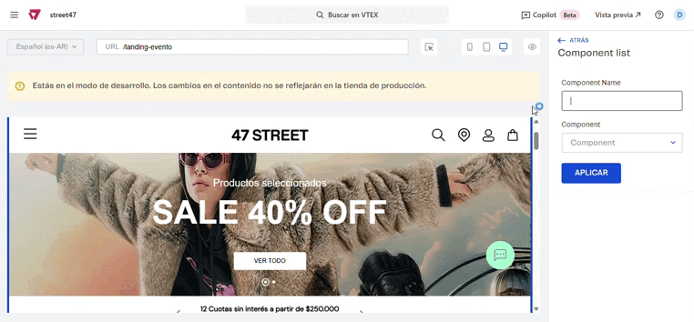

# 📌 Template de landing por bloques

## Descripción

Este desarrollo permite crear diferentes landings partiendo de un mismo template que cuenta con los siguientes bloques:&#x20;

1. Top Banner
2. Slider de promociones
3. Infocards - Banners
4. Reloj - cuenta regresiva
5. Carrusel de productos
6. Carrusel de categorías
7. Facilitadores

La ventaja de este template, es que podrán agregarse la cantidad necesaria de estos bloques y reordenarlos según conveniencia.&#x20;

## Pasos para la configuración


Si bien para el desarrollo se creó una URL que ya tiene asignado este template, en esta sección se explicará cómo crear una nueva landing a partir del template desde 0. En caso de utilizar la landing **/hotsale** saltear al punto&#x20;


1.  Ingresamos por **Storefront -> Páginas** y hacemos click en **Crear Nueva.** 

    <figure><figcaption></figcaption></figure>
2.  Al ingresar debemos colocar el nombre del template, lo que autocompletará la URL de la landing. Podemos dejar el nombre que genera VTEX y modificarlo en el campo URL. 

    <figure><figcaption></figcaption></figure>
3.  Scrolleamos hasta el campo template y seleccionamos el que se llama **street47.theme@7.x:store.custom.landings#landing-evento** y le damos click a **Guardar.** 

    <figure><figcaption></figcaption></figure>
4.  Una vez creada la página, nos dirigimos a **Storefront -> Site Editor** e ingresamos en el buscador la URL que creamos. Para este ejemplo, voy a ingresar a **/landing-evento** que se creó para el evento del Hot Sale. 

    <figure><figcaption></figcaption></figure>

5.  En la parte de bloques, vamos a encontrar el bloque **Landing Evento** que contiene los bloques que ya se encuentran creados y vamos a estar mostrando en la landing. Actualmente se muestran en orden: Carrusel de imágenes (Top Banner), Slider de Promociones, Banner Categorías (+3), Banner Categorías 2 (Banner al 100%), Grilla imágenes (Categorías destacadas), Grilla imágenes 2 (Categorías con promoción), Reloj contador, Banner + Carrusel productos, Carrusel de productos . 

    <figure><figcaption></figcaption></figure>
6.  Al abrir e ingresar a cada uno de estos bloques, podremos editar los textos, imágenes, colecciones como en el resto del sitio. 

    <figure><figcaption></figcaption></figure>
7.  Si hacemos click en **Landing Evento,** podremos reordenar los bloques, haciendo click en los 6 puntitos que se encuentran a la izquierda y arrastrando el bloque hasta la posición deseada. 

    <figure><figcaption></figcaption></figure>

8.  También podremos eliminar bloques, haciendo click en los 3 puntitos ubicados a la derecha y haciendo click en **Eliminar**. 

    <figure><figcaption></figcaption></figure>
9.  Si queremos editar alguno de estos bloques ya creados, debemos hacer click en **Editar** (esta acción es únicamente para editar el nombre del bloque o el bloque asignado). 

    <figure><figcaption></figcaption></figure>
10. Por último, para poder agregar nuevos bloques debemos hacer click en **Agregar,** asignarle un nombre y elegir entre los tipos de bloques disponibles. 

    <figure><figcaption></figcaption></figure>

    <figure><figcaption></figcaption></figure>
11. Una vez creado el nuevo bloque, podemos editarlo como se detalla en el punto 6.
12. Cuando ya tenemos toda la información completa de la landing, hacemos click en **Guardar** para que se apliquen en el sitio en producción.

## Aclaración:

Para configurar el reloj contador, se debe ingresar al bloque y configurar el título, hora de inicio y fin

<figure><figcaption></figcaption></figure>
