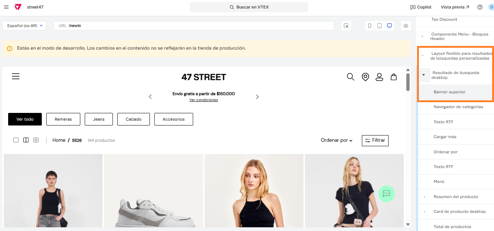

# 📌 Top banner

## Descripción

Este componente permite configurar un top banner en sábana de productos desde el site editor.&#x20;

### Pasos para la configuración

1. Acceder al administrador de VTEX.
2. Ingresar por **Storefront** → **Site Editor**.
3.  Una vez en el sitio, se deberá ingresar en la sábana que queramos agregar el banner. Para este ejemplo, usaremos **/newin.** 

    <figure><figcaption></figcaption></figure>
4.  Una vez allí, abriremos el bloque **Layout flexible para resultados de búsquedas personalizadas** y el bloque **Resultado de búsquedas** (desktop o mobile según corresponda) e ingresaremos al bloque llamado **Banner superior.**

    <figure><figcaption></figcaption></figure>
5. Al ingresar, debemos completar los siguientes campos para que el banner se visualice correctamente:
   1. Imagen: Seleccionaremos la imagen que queremos visualizar.&#x20;
   2. Nueva pestaña: Se puede activar esta opción para que al hacer click redirija a la URL configurada en una nueva pestaña.&#x20;
   3. URL: Completaremos con la URL a la que queramos que redirija el banner.&#x20;
   4.  Texto alternativo: Podemos completar un texto alternativo a la imagen. El mismo no será visible pero si es de utilidad para personas que utilizan herramientas de accesibilidad.   

       <figure><figcaption></figcaption></figure>
   5.  Título de la imagen: Podemos completar con un título que se visualizará como etiqueta al pasar el mouse sobre la imagen. 

       <figure><figcaption></figcaption></figure>
6. Los últimos campos recomendamos dejarlos con esta configuración:

<figure><figcaption></figcaption></figure>

7. Al finalizar la carga del banner, hacemos click en **Guardar** y ya podremos visualizarlo en el sitio.&#x20;
