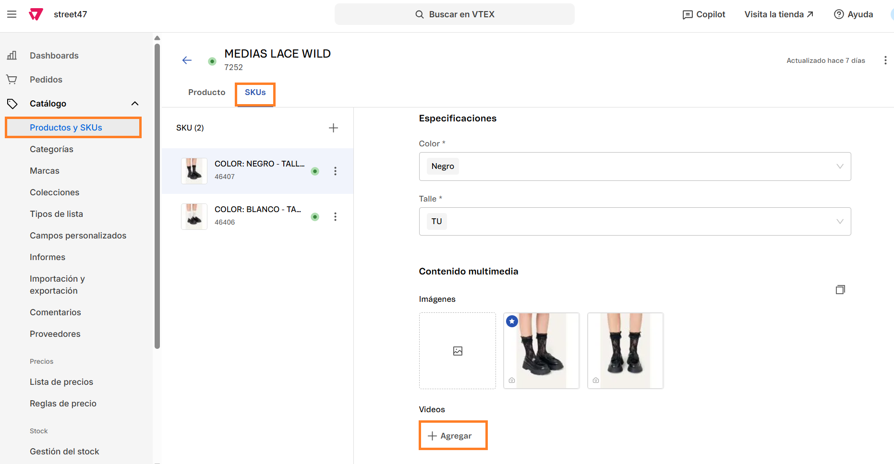
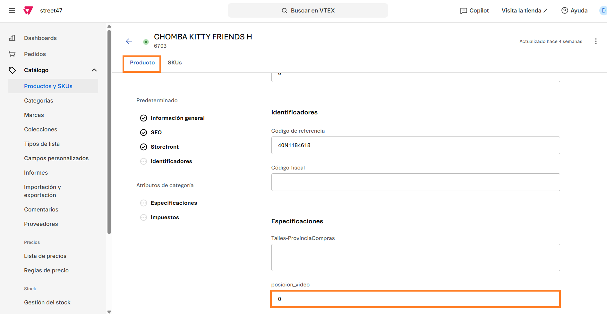

# 📌 Video en sábana y ficha de producto

## Descripción

Permite cargar desde el administrador de Vtex un video que se visualice en la sábana y ficha de producto.

Consideraciones:

* El video tiene autoplay.
* Será el mismo video que se muestra en ficha de producto y se cargará en el mismo lugar.
* El video se cargará en la primera variante y se visualizará en las demás también.
* El video deberá tener el mismo tamaño que las imágenes del producto.
* El video se visualizará en primera posición tanto en PLP como PDP a menos que se le configure una posición dentro de la especificación "posicion\_video" del producto.

## **Pasos para la configuración**

1. Acceder al administrador de VTEX.
2. Ingresar por **Catálogo** →  **Todos los productos**.
3.  Buscamos el producto al cual le queremos agregar el video y hacemos click en el desplegable y hacemos click en “**Ver lista de SKUs**”.

    <figure><figcaption></figcaption></figure>
4.  Al ingresar, nos dirigimos al apartado de **SKUs** y hacemos click en **+Agregar** dentro del apartado **Videos**. Nos solicitará completar la URL del mismo. 

    <figure><figcaption></figcaption></figure>

    <figure><figcaption></figcaption></figure>

5. Hacemos click en **Aplicar** para que se guarde la URL y click en “**Guardar**” para que quede guardado dentro del producto.&#x20;
6.  Una vez guardado el video, podemos volver a la pestaña de **Producto** y buscar la especificación llamada **"posicion\_video"**, donde podremos asignarle otra posición para la ficha.  

    <figure><figcaption></figcaption></figure>

    1. En caso que este valor este en 0 o vacío, el video se mostrará en primera posición tanto en PLP como en PDP
    2. Si modificamos esa posición, sólo se visualizará en PDP con la posición asignada.&#x20;
7. Una vez configurada la posición, hacemos click en **Guardar** y una vez reindexado el producto, podemos verificar que se hayan aplicado los cambios.&#x20;
