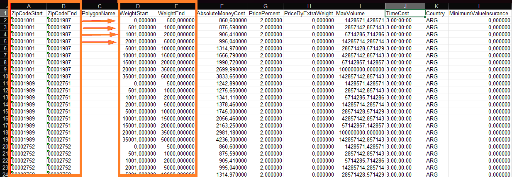
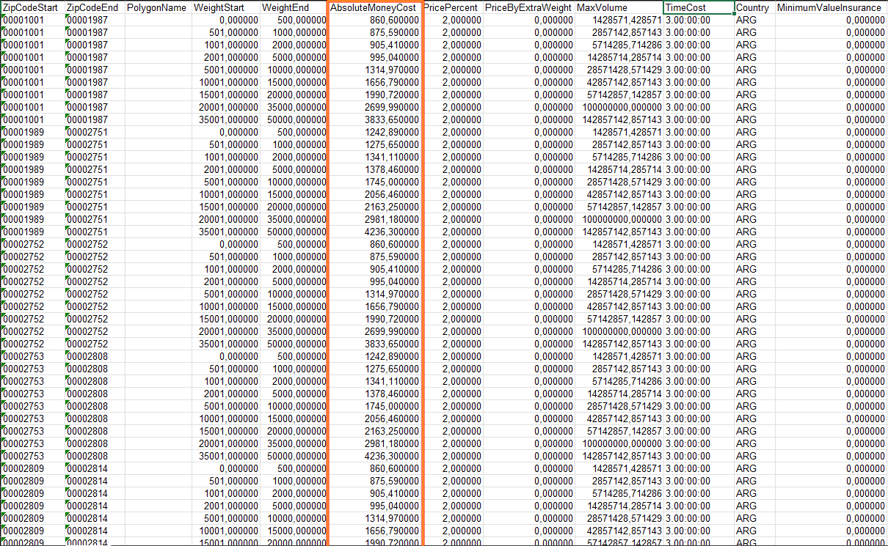
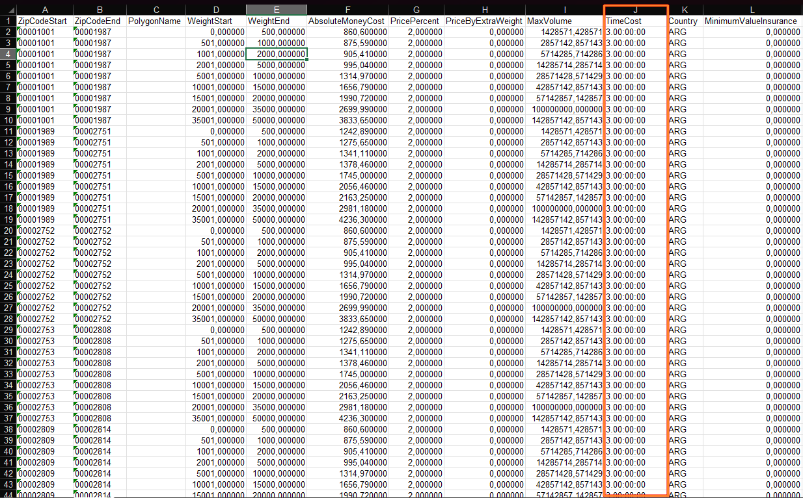

---
layout:
  width: default
  title:
    visible: true
  description:
    visible: false
  tableOfContents:
    visible: true
  outline:
    visible: true
  pagination:
    visible: true
  metadata:
    visible: true
  tags:
    visible: true
  actions:
    visible: true
---

# 📦 Planilla de costos y tiempos

## Descripción

Para realizar la modificación de los costos de envío y tiempo de envío, debemos dirigirnos dentro del menú a la sección envío, al apartado Estrategia de envío.

<figure><figcaption></figcaption></figure>

Dentro de estrategia de envío encontraremos las diferentes modalidades de envío configuradas en la plataforma. En este ejemplo tomaremos la llamada "Andreani Estandar" para mostrar el paso a paso.

Deberemos clickear sobre los tres botones y luego en editar.

<figure><figcaption></figcaption></figure>

Una vez dentro del método de envío deberemos ir a la sección Tarifas de envío y clickear en donde dice descargar tarifas en envío.

<figure><figcaption></figcaption></figure>

Una vez realizado el paso anteriormente mencionado, nos estará llegando a nuestro mail una planilla con los costos de envíos que tenemos vigentes aperturado por CP y por peso.&#x20;

Tendremos que proceder a descargar la planilla que se encuentra adjunta en el mail haciendo click en el texto "haz click aqu&#xED;**".**

<figure><figcaption></figcaption></figure>

La planilla de costos se apertura por dos criterios: código postal (ZipCode columnas A y B) y peso (Weight columnas D y E).

<figure><figcaption></figcaption></figure>

¿Esto qué quiere decir? Bien, en el caso de la fila 1:

Está el ZipCodeStart (A) en 00001001, y el ZipCodeEnd (B) en 00001987. El WeightStart (D) y el WeightEnd (E) correspondientes a esa fila son: 0 y 500 respectivamente.

Esto quiere decir que, la Fila 1, establece la configuración para todos los envíos a los códigos postales del 1001 al 1987, cuyo peso del envío total sea entre 0 y 500 gramos.

En la Fila 2, tenemos los mismos códigos postales pero diferentes pesos, es decir que la línea 2 establece la configuración para todos los envíos a los códigos postales del 1001 al 1987, cuyo peso del envío total sea entre 501 y 1000 gramos.\
Y así, con cada línea.

## Actualizar costos

Teniendo descargada la planilla, procederemos a modificar la misma. La única celda que deberemos modificar será la llamada "AbsolutMoneyCost", siempre dependiendo de los códigos postales y los pesos que observamos anteriormente.

<figure><figcaption></figcaption></figure>


Tener presente que esta planilla impacta directamente con lo que se le va a cobrar al cliente de costo de envío, por lo que se debe tener precaución con la manipulación de los datos cargados en ella. Se debe contemplar que el costo de envío puede variar entre los diferentes CP o por el peso aforado de los paquetes


## Actualizar tiempo

En el caso del tiempo de envío, la columna de interés será la J, TimeCost. Está expresada en formato D.hh:mm:ss


**VTEX** actualmente permite únicamente día. Los demás valores deben ir en 0 (cero).


<figure><figcaption></figcaption></figure>

En este ejemplo el TimeCost (J) de todas las filas está en 3.00:00:00. Esto quiere decir que todas las filas tienen configurado tres días de tiempo de demora en el envío.\
En caso que quiera cambiarse, por ejemplo, a 7 días, el valor a ingresar será 7.00:00:00. **VTEX** actualmente permite únicamente día. Los demás valores deben ir en 0 (cero).

## Subida de planilla

Habiendo editado la planilla, procederemos a cargarla. Nos volveremos a dirigir a menú, inventario, estrategias de envío y en la sección de cargar tarifas de envío, adjuntaremos la planilla que hemos editado

<figure><figcaption></figcaption></figure>

Una vez realizada la carga de la planilla editada debemos esperar entre 10 y 15 minutos para la indexación de estos costos y tiempos de envío. Podremos corroborar la correcta indexación desde la sección **Tarifas de envío**. 
